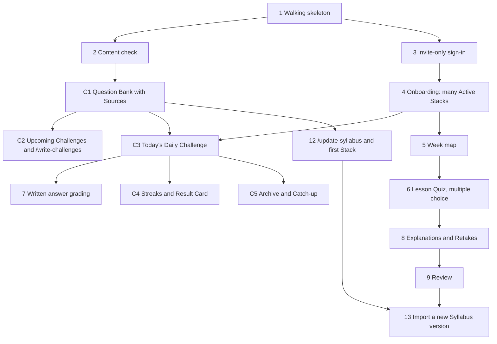

# Implementation order: Learning App version 1

Version 1 proves two loops. The **Daily Challenge loop**: an invited Learner activates one or more Stacks, plays each Stack's Daily Challenge, keeps a Streak, shares a Result Card, and catches up from the Archive. The **Lesson path**: the Learner works through Lessons and Lesson Quizzes, clears Missed Questions with Retakes, and practises in Review. Meanwhile the Admin writes Upcoming Challenges and keeps the Syllabus current with Claude Code. Terms follow [CONTEXT.md](../CONTEXT.md), and the decisions behind the design are in [docs/adr/](adr/), especially [0003](adr/0003-daily-challenge-is-the-core-loop.md), [0004](adr/0004-append-only-question-bank-with-sources.md) and [0005](adr/0005-all-days-are-utc.md).

Existing tickets are GitHub issues #1–#13 on [fahim36/InterviewCrackerAssistant](https://github.com/fahim36/InterviewCrackerAssistant/issues). The Daily Challenge tickets are labelled **C1–C5** below and haven't been filed yet. Each ticket works end to end on its own, from the database through to the UI with tests, and can be demoed.

## Changes to existing tickets (not yet made on GitHub)

| Ticket | Change |
|---|---|
| [#2](https://github.com/fahim36/InterviewCrackerAssistant/issues/2) Content check | Stays as the base check. C1 adds the Source, retirement and Concept-repeat rules. |
| [#4](https://github.com/fahim36/InterviewCrackerAssistant/issues/4) Onboarding | Activate **one or more** Stacks. No time zone step (all Days are UTC). |
| [#5](https://github.com/fahim36/InterviewCrackerAssistant/issues/5) Week map | Lock states come from completion only; no Pending Review Round. |
| [#7](https://github.com/fahim36/InterviewCrackerAssistant/issues/7) Written answer grading | Now blocked by C3 instead of #6, since each Daily Challenge has one written Question. |
| [#9](https://github.com/fahim36/InterviewCrackerAssistant/issues/9) Daily Review: Round 1 | Becomes **Review**: an optional queue in sets of up to 10, with no rounds, timers or blocking. |
| [#10](https://github.com/fahim36/InterviewCrackerAssistant/issues/10) Rounds 2 and 3 | No longer needed. Close. |
| [#11](https://github.com/fahim36/InterviewCrackerAssistant/issues/11) Streak | Replaced by C4 (a Streak per Stack, counting Daily Challenges). Close. |
| [#12](https://github.com/fahim36/InterviewCrackerAssistant/issues/12) `/update-syllabus` | Adds Questions with Sources to the Question Bank and can retire or re-tag them; never replaces the bank. |
| [#13](https://github.com/fahim36/InterviewCrackerAssistant/issues/13) Import a new Syllabus version | Replaces the Syllabus only; the Question Bank is appended to. |

## New Daily Challenge tickets

- **C1 · Question Bank with Sources.** Permanent Question IDs, at least one Source per Question (accessed in the same run), Retired Questions with reason and replacement, Questions tagged to a Stack and optionally a Lesson. The content check enforces Sources and warns on repeated Concepts.
- **C2 · Upcoming Challenges and `/write-challenges`.** A Claude Code command that reads the whole Question Bank and writes the next few Days of Daily Challenges. Upcoming Challenges are editable until released and frozen after. The content check and an Admin page show how many Days are written and warn below three.
- **C3 · Today's Daily Challenge.** Released at 00:00 UTC, numbered from the Stack's launch, one try, Explanation and Sources after each answer, misses recorded as Missed Questions. Multiple choice first; the written Question is graded once #7 lands.
- **C4 · Streaks and Result Card.** A Streak per Active Stack, extended only by playing that Day's Challenge. A shareable Result Card showing the score without Questions or answers.
- **C5 · Archive and Catch-up.** Every released Challenge back to #1, playable if not yet played, never counting toward a Streak. Retired Questions shown but not answerable. A Catch-up list of unplayed Challenges across Active Stacks.

## Dependency graph

## Order

| Step | Ticket | Blocked by | Can run alongside |
|---|---|---|---|
| 1 | **#1 · Walking skeleton**: one Lesson from a content file, live on a URL | none | nothing |
| 2 | **#2 · Content check** before commit | 1 | 3 |
| 2 | **#3 · Invite-only sign-in** | 1 | 2, C1 |
| 3 | **C1 · Question Bank with Sources** | 2 | 3, 4 |
| 3 | **#4 · Onboarding**: activate one or more Stacks | 3 | C1, C2 |
| 4 | **C2 · Upcoming Challenges and `/write-challenges`** | C1 | 4, C3 |
| 5 | **C3 · Today's Daily Challenge** | 4, C1 | C2, 12 |
| 6 | **#7 · Grading written answers** against the Model Answer | C3 | C4, C5, 5 |
| 6 | **C4 · Streaks and Result Card** | C3 | 7, C5, 5 |
| 6 | **C5 · Archive and Catch-up** | C3 | 7, C4, 5 |
| any time after C1 | **#12 · `/update-syllabus`** and the first Stack | C1 | C2 onwards |
| 7 | **#5 · Week map** with lock states and Milestones | 4 | C3 onwards |
| 8 | **#6 · Lesson Quiz** (multiple choice) and unlocking | 5 | 12 |
| 9 | **#8 · Explanations and Retakes** | 6 | 12 |
| 10 | **#9 · Review** | 8 | 12 |
| last | **#13 · Importing a new Syllabus version** without losing progress | 9, 12 | none |

## Suggested path for one person

1 → 2 → C1 → 3 → 4 → C2 → C3 → 7 → C4 → C5 → 12 → 5 → 6 → 8 → 9 → 13

Do C2 before C3. It fills the first Days of real Daily Challenges, so C3 is built and tested on real content instead of placeholders.

## Milestones worth demoing

- **After 1:** the app is live on a public URL, the first entry for your portfolio.
- **After C3:** a Learner can play today's Daily Challenge for any of their Active Stacks.
- **After C5:** the full game: Streaks, a shareable Result Card, and an Archive for late joiners. This is the portfolio story ("LinkedIn Games for interview prep").
- **After 6:** the Lesson path works: study a Lesson, pass its quiz, unlock the next.
- **After 13:** the Syllabus updates without disturbing Learners' progress, and the Question Bank keeps growing.

## Version 2 and later (not ticketed yet)

- **Version 2:** Placement Quizzes, push notifications, leaderboards, Stack Requests with `/new-stack`, Disputes with `/review-disputes`, Weak Concepts, and a weekly scheduled Syllabus Update.
- **Version 3:** coding exercises run against tests, and open sign-up.
