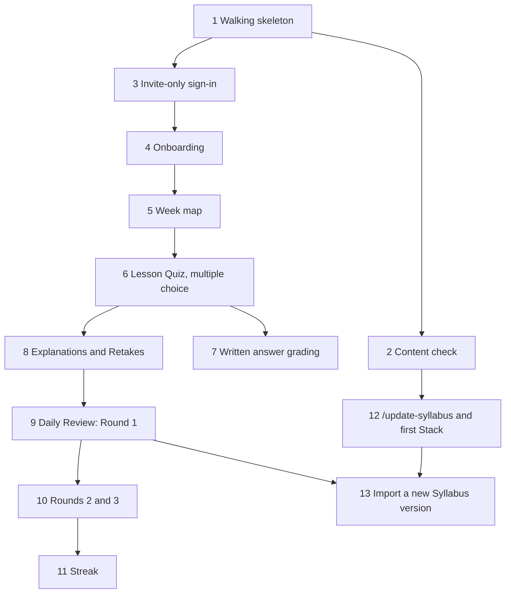

# Implementation order: Learning App version 1

Version 1 proves the whole learning loop: an invited Learner picks a Stack, works through Lessons and Lesson Quizzes, clears Missed Questions with Retakes, and keeps up a Daily Review. Meanwhile the Admin keeps the Syllabus current with Claude Code. Terms follow [CONTEXT.md](../CONTEXT.md), and the decisions behind the design are in [docs/adr/](adr/).

Tickets are GitHub issues #1–#13 on [fahim36/InterviewCrackerAssistant](https://github.com/fahim36/InterviewCrackerAssistant/issues), all labelled `ready-for-agent` and linked with GitHub's native blocking. Each ticket works end to end on its own, from the database through to the UI with tests, and can be demoed.

## Dependency graph

## Order

| Step | Ticket | Blocked by | Can run alongside |
|---|---|---|---|
| 1 | **[#1](https://github.com/fahim36/InterviewCrackerAssistant/issues/1) · Walking skeleton**: one Lesson from a content file, live on a URL | none | nothing |
| 2 | **[#2](https://github.com/fahim36/InterviewCrackerAssistant/issues/2) · Content check** before commit | 1 | 3–11 |
| 2 | **[#3](https://github.com/fahim36/InterviewCrackerAssistant/issues/3) · Invite-only sign-in** | 1 | 2, 12 |
| 3 | **[#4](https://github.com/fahim36/InterviewCrackerAssistant/issues/4) · Onboarding**: pick an Active Stack and time zone | 3 | 2, 12 |
| 4 | **[#5](https://github.com/fahim36/InterviewCrackerAssistant/issues/5) · Week map** with lock states and Milestones | 4 | 2, 12 |
| 5 | **[#6](https://github.com/fahim36/InterviewCrackerAssistant/issues/6) · Lesson Quiz** (multiple choice) and unlocking | 5 | 12 |
| 6 | **[#7](https://github.com/fahim36/InterviewCrackerAssistant/issues/7) · Grading written answers** against the Model Answer | 6 | 8, 9–11, 12 |
| 6 | **[#8](https://github.com/fahim36/InterviewCrackerAssistant/issues/8) · Explanations and Retakes** | 6 | 7, 12 |
| 7 | **[#9](https://github.com/fahim36/InterviewCrackerAssistant/issues/9) · Daily Review**: Round 1 and blocking | 8 | 7, 12 |
| 8 | **[#10](https://github.com/fahim36/InterviewCrackerAssistant/issues/10) · Rounds 2 and 3**, carry-over and leaving the rotation | 9 | 7, 12, 13 |
| 9 | **[#11](https://github.com/fahim36/InterviewCrackerAssistant/issues/11) · Streak** | 10 | 7, 12, 13 |
| any time after 2 | **[#12](https://github.com/fahim36/InterviewCrackerAssistant/issues/12) · `/update-syllabus`** and the first Stack | 2 | 3–11 |
| last | **[#13](https://github.com/fahim36/InterviewCrackerAssistant/issues/13) · Importing a new Syllabus version** without losing progress | 9, 12 | 10, 11 |

## Suggested path for one person

1 → 2 → 12 → 3 → 4 → 5 → 6 → 8 → 7 → 9 → 10 → 11 → 13

Do 12 early. It turns the 16-week plan into real Question Banks, so every quiz ticket after it can be tested on real content instead of placeholders.

## Milestones worth demoing

- **After 1:** the app is live on a public URL, the first entry for your portfolio.
- **After 6:** the core loop works: study a Lesson, pass its quiz, unlock the next.
- **After 9:** the "catch up before moving on" rule works.
- **After 13:** the Syllabus updates itself without disturbing Learners' progress. This is the portfolio story.

## Version 2 and later (not ticketed yet)

- **Version 2:** Placement Quizzes, push notifications, Stack Requests with `/new-stack`, Disputes with `/review-disputes`, Weak Concepts, and the weekly scheduled Syllabus Update.
- **Version 3:** coding exercises run against tests, and open sign-up.
